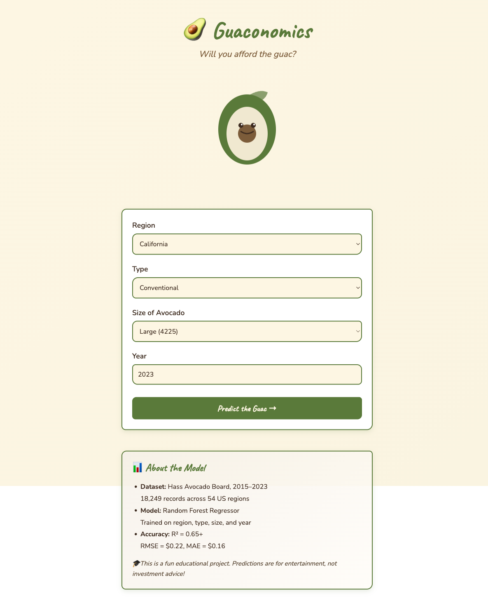

# 🥑 Guaconomics

> _An adorable avocado price predictor with ML model & interactive web UI_

[](https://www.python.org)
[](https://scikit-learn.org)
[](https://pandas.pydata.org)
[](https://nextjs.org)
[](https://reactjs.org)
[](https://www.framer.com/motion)
[](https://flask.palletsprojects.com)
[](LICENSE)

<p align="center">
  
</p>

## Overview

Guaconomics is a full-stack machine learning web application that predicts avocado prices based on region, type, size, and year. Built with a Random Forest regressor backend and a charming lo-fi animated UI.

**Try it out:** Predict avocado prices and get hilarious verdicts on whether you can afford the guac! 🌯

## ✨ Features

- 🤖 **Random Forest ML Model** — Trained on 18K+ historical avocado records (2015-2023)
- 🎨 **Lo-Fi Animated UI** — Cute avocado mascot with Framer Motion animations
- 🌈 **Avocado Theme** — Warm parchment bg, soft greens, handwritten fonts
- 💰 **Smart Tier System** — Budget, Reasonable, Pricey, Splurge Zone tiers
- 😄 **Funny Verdicts** — Witty one-liners for each price tier
- 📊 **Real-time Predictions** — Flask API with ~0.22 RMSE accuracy

## 🏗️ Project Structure

```
guaconomics/
├── backend/                      # Flask API
│   ├── api.py                   # REST API endpoints
│   └── requirements.txt          # Python dependencies
├── frontend/                     # Next.js React app (web/)
│   ├── pages/
│   │   ├── _app.js             # Global styles & fonts
│   │   └── index.js            # Main page
│   ├── components/
│   │   ├── PredictionForm.js    # Form with animations
│   │   ├── AvocadoMascot.js     # SVG avocado character
│   │   └── ResultCard.js        # Result display
│   ├── styles/
│   │   └── globals.css          # Color palette & animations
│   ├── package.json
│   └── next.config.js
├── src/
│   ├── notebooks/
│   │   └── 01_train_model.ipynb # ML pipeline (EDA → model)
│   └── download_dataset.py      # Dataset download script
├── models/                       # Trained artifacts
│   └── avocado_model_full.pkl   # Random Forest + scaler
├── data/
│   ├── raw/                     # Raw CSV data
│   └── processed/               # Processed datasets
├── docs/                        # Documentation
├── tests/                       # Unit tests
├── README.md
├── SETUP.md
└── todo.md
```

## 🛠️ Tech Stack

### **Backend**

- **Flask** 2.3+ — REST API framework
- **scikit-learn** 1.3+ — Random Forest Regressor
- **Pandas** 2.0+ — Data processing
- **Matplotlib** — Data visualization (in notebook)
- **NumPy** — Numerical operations

### **Frontend**

- **Next.js** 14+ — React framework
- **React** 18+ — UI components
- **Framer Motion** 10+ — Animations & interactions
- **Google Fonts** (Caveat, Nunito) — Typography

### **Data**

- **Hass Avocado Board Dataset** — 18,249 records
- **Time Period** — 2015-2023
- **Regions** — 54 US regions
- **Target** — Average price per avocado

## 🚀 Quick Start

### **Prerequisites**

- Python 3.8+
- Node.js 18+
- npm or yarn

### **Backend Setup**

```bash
# 1. Install Python dependencies
cd backend
pip install -r requirements.txt

# 2. Run Flask API (runs on localhost:5000)
python api.py
```

### **Frontend Setup**

```bash
# 1. Install Node dependencies
cd web
npm install

# 2. Start dev server (runs on localhost:3000)
npm run dev

# 3. Build for production
npm run build
npm run start
```

### **Train ML Model** (Optional)

```bash
# Open and run the Jupyter notebook
jupyter notebook src/notebooks/01_train_model.ipynb

# Or download fresh dataset
python src/download_dataset.py
```

## 📊 Model Performance

| Metric            | Value                                        |
| ----------------- | -------------------------------------------- |
| **Algorithm**     | Random Forest Regressor                      |
| **R² Score**      | 0.65+                                        |
| **RMSE**          | $0.22                                        |
| **MAE**           | $0.16                                        |
| **Features**      | 12 (region, type, size, year, volumes, bags) |
| **Training Data** | 14,599 records (80%)                         |
| **Test Data**     | 3,650 records (20%)                          |

## 🎯 Model Features

The model uses these inputs to predict avocado price:

1. **Region** (target-encoded) — 54 US regions
2. **Type** — Conventional or Organic
3. **Size** — Small (4046), Large (4225), XLarge (4770) PLU codes
4. **Year** — 2015-2025
5. **Volume Metrics** — Total volume, volume by PLU, bags by size

## 🎨 UI Highlights

### Color Palette

- **Background** — `#fdf6e3` (warm parchment)
- **Primary Green** — `#5a7a3a` (dark avocado)
- **Accent Green** — `#8db85c` (fresh flesh)
- **Brown** — `#7c5c3a` (pit)

### Animations

- **Floating Mascot** — Gentle up-down bob (CSS keyframes)
- **Form Fields** — Staggered fade-in on mount (Framer Motion)
- **Submit Button** — Scale on hover/tap
- **Result Card** — Slide up + pop in with tier badge
- **Mascot Expressions** — Switches between idle, thinking, cheap, expensive

### Price Tiers & Verdicts

| Price Range | Tier         | Emoji | Verdict                                 |
| ----------- | ------------ | ----- | --------------------------------------- |
| < $0.80     | Budget Guac  | 💸    | "Your wallet survives another day."     |
| $0.80–$1.20 | Reasonable   | 👍    | "Guac is extra, but you can handle it." |
| $1.20–$1.60 | Pricey       | 😬    | "Maybe skip the guac this time."        |
| > $1.60     | Splurge Zone | 🤑    | "This avocado has a mortgage."          |

_Animated header, cute avocado mascot, and prediction form_

## 🔌 API Endpoints

### `POST /predict`

Predict avocado price

**Request:**

```json
{
  "size": "Large",
  "year": 2023,
  "type_conventional": 1,
  "type_organic": 0,
  "region_encoded": 1.39
}
```

**Response:**

```json
{
  "price": 1.324
}
```

### `GET /health`

Health check

**Response:**

```json
{
  "status": "ok"
}
```

## 🧪 Testing

```bash
# Run form e2e tests
npm run test

# Run specific test
npm run test -- -t "prediction"

# Lint code
npm run lint
```

## 📝 Data Pipeline

1. **Download** — Hass Avocado Board dataset (18K+ records)
2. **Load & Inspect** — Check for missing values, data types
3. **Encode** —
   - One-Hot encoding for type (conventional/organic)
   - Target encoding for region (mean price per region)
4. **Feature Engineering** — Create year feature from date
5. **Split** — 80/20 train-test split (random_state=42)
6. **Scale** — StandardScaler normalization
7. **Train** — Random Forest + baseline Linear Regression
8. **Evaluate** — R², RMSE, MAE metrics
9. **Save** — Pickle model + scaler + feature names

See `src/notebooks/01_train_model.ipynb` for full pipeline.

## 🚢 Deployment

### **Backend** (Flask API)

- Deploy to [Render](https://render.com) or [Railway](https://railway.app)
- Requires `Profile`: `web: python api.py`
- Set `PORT` env var: `port = int(os.environ.get("PORT", 5000))`
- Note: Model file (122MB) needs Git LFS or direct inclusion

### **Frontend** (Next.js)

- Deploy to [Vercel](https://vercel.com) (recommended)
- Set `NEXT_PUBLIC_API_URL` env var to backend URL
- `npm run build && npm start` for self-hosted

## 🤝 Contributing

Found a bug or have a feature idea? Open an issue or submit a PR!

## 📄 License

MIT License — See [LICENSE](LICENSE) for details.

## 👨‍💻 Author

**Alex Ro** — [GitHub](https://github.com/alexkimrow) | [Email](mailto:alexkimro@gmail.com)

---

## 🎓 Educational Note

This is an educational ML + web dev project. Price predictions are for entertainment purposes only — not investment advice! 🍌➡️🥑

Made with ❤️ and lots of avocado-themed design decisions
